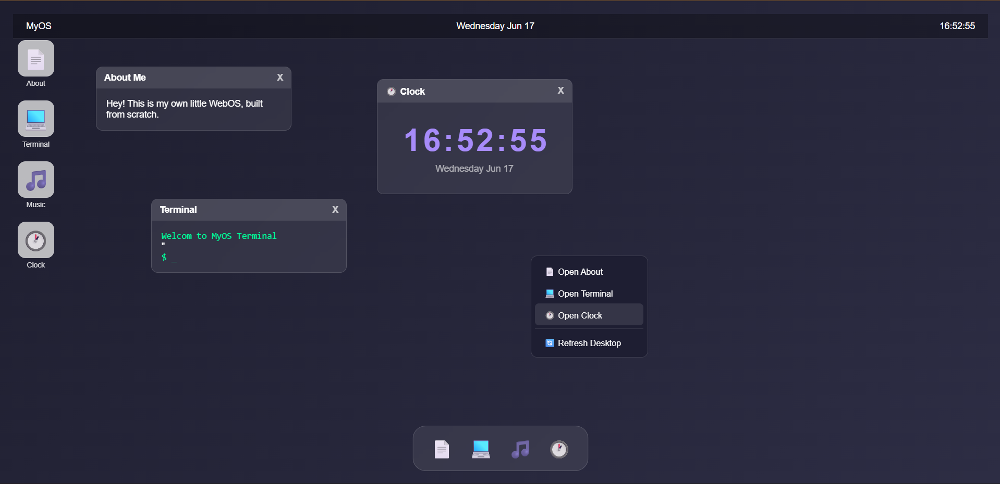

# Nebula OS

Nebula OS is a fully self-contained, single-page web operating system built with vanilla web technologies. It features a rich, interactive desktop environment complete with window management, apps, widgets, and dynamic background effects.

## Features

- **Window Management**: Movable, resizable, and minimizable windows with stacking contexts (z-index).
- **Terminal**: A functional command-line interface with various commands (try `help`).
- **Music Player**: A virtual vinyl player with audio visualization (Web Audio API). Load local audio files to play.
- **Calculator**: A fully functional desktop calculator.
- **Notes**: A rich-text editor for jotting down thoughts.
- **Paint**: A canvas-based drawing application with tools, colors, and the ability to save your creations.
- **Snake Game (Ouroboros Simulation)**: A classic snake game built directly into the OS.
- **Widgets**: Real-time telemetry, reality monitor, and network broadcast widgets.
- **Boot Sequence**: An immersive startup animation.
- **Wormhole / Singularity**: A special feature hidden in the dock—try it if you dare.

## Technologies Used

- **HTML5**: Structure and layout (Semantic HTML, Canvas).
- **CSS3**: Styling, animations, flexbox/grid layouts, and custom properties (variables). No external CSS frameworks were used.
- **Vanilla JavaScript**: Core logic, DOM manipulation, event handling, and window management. No external JS libraries or frameworks were used.
- **Web Audio API**: For the music player's audio visualization.
- **Web Canvas API**: Used in the Paint app, Snake game, and background/wormhole effects.
- **LocalStorage**: To persist settings or state (where applicable).

## Installation

Nebula OS is completely self-contained. There are no build tools or dependencies required.

1. Clone or download the repository.
2. Open `index.html` in any modern web browser.

That's it!

## Controls & Usage

- **Click / Drag**: Interact with icons, buttons, and drag windows by their title bars.
- **Double Click**: Open apps from the desktop icons.
- **Context Menu**: Right-click on the desktop to access the context menu.
- **Terminal**: Type commands and press `Enter`.
- **Music Player**: Click the folder icon to load an audio file, or use the drop zone.
- **Paint**: Select a tool and color, then click and drag on the canvas.
- **Snake Game**: Use the arrow keys to control the snake.

## Acknowledgements

- Fonts provided by Google Fonts (Archivo Black, Inter, JetBrains Mono, Syne).
- Icons and SVG shapes are custom-built or carefully sourced for the Nebula aesthetic.
