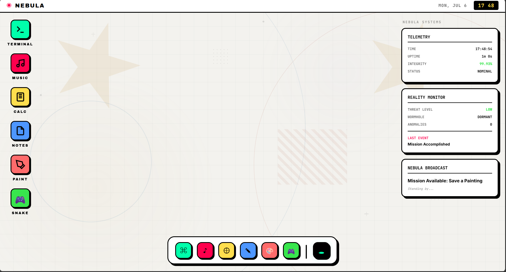
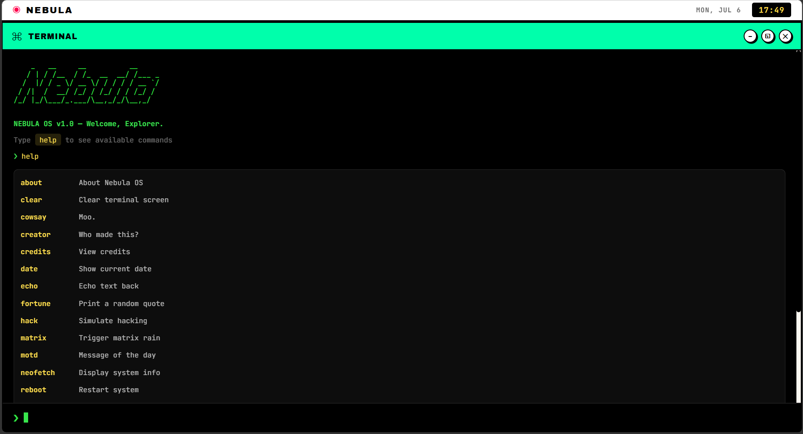
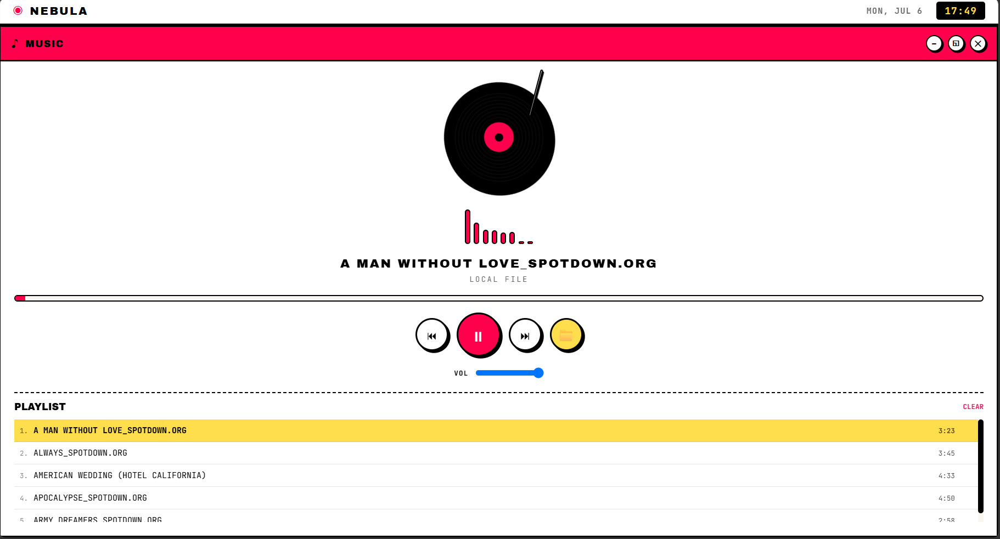
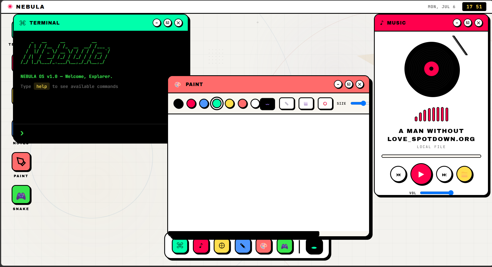
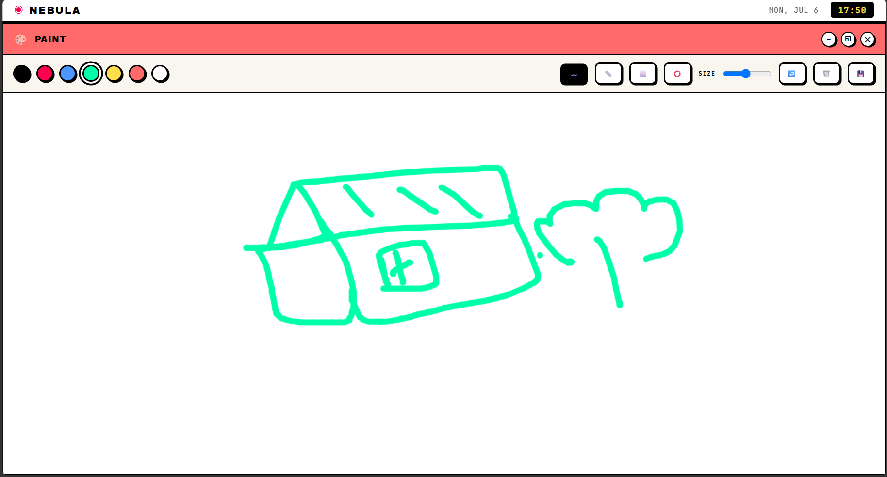

# Nebula OS
> Built for the Stardance Hack Club WebOS Challenge.

Nebula OS is a browser-based desktop experience inspired by operating systems, built entirely with vanilla HTML, CSS, and JavaScript. It combines a neo-brutalist interface with interactive apps, hidden discoveries, persistent state, and playful system simulations. It features a rich, interactive desktop environment complete with window management, apps, widgets, and dynamic background effects.

### Gallery

<table align="center">
  <tr>
    <td align="center">
       
      <b>Interactive Terminal</b>
    </td>
    <td align="center">
       
      <b>Vinyl Music Player</b>
    </td>
  </tr>

  <tr>
    <td align="center">
       
      <b>Desktop Multitasking</b>
    </td>
    <td align="center">
       
      <b>Canvas Paint App</b>
    </td>
  </tr>
</table>

## Features

- **Window Management**: Draggable desktop windows with minimize, maximize, restore, focus management, and persistent positions.
- **Terminal**: A functional command-line interface with various commands (try `help`).
- **Music Player**: A virtual vinyl player with audio visualization (Web Audio API). Load local audio files to play.
- **Calculator**: A desktop calculator with hidden discoveries and special system events.
- **Notes**: A persistent rich-text editor with local saving.
- **Paint**: A canvas-based drawing application with tools, colors, and the ability to save your creations.
- **Snake Game (Ouroboros Simulation)**: A classic snake game built directly into the OS.
- **Desktop Widgets**: Live telemetry, reality monitor, and broadcast panels that react to system activity.
- **Boot Sequence**: An immersive startup animation.
- **Wormhole / Singularity**: A special feature hidden in the dock—try it if you dare.
- **Discoveries & Missions**: Hidden interactions, unlockable discoveries, explorer ranks, and secret terminal commands encourage exploration.

## Technologies Used

- **HTML5**: Structure and layout (Semantic HTML, Canvas).
- **CSS3**: Styling, animations, flexbox/grid layouts, and custom properties (variables). No external CSS frameworks were used.
- **Vanilla JavaScript**: Core logic, DOM manipulation, event handling, and window management. No external JS libraries or frameworks were used.
- **Web Audio API**: For the music player's audio visualization.
- **Web Canvas API**: Used in the Paint app, Snake game, and background/wormhole effects.
- **LocalStorage**: Persists notes, discoveries, window state, explorer progress, and user preferences between sessions.

## Installation

Nebula OS is completely self-contained. There are no build tools or dependencies required.

1. Clone or download the repository.
2. Open `index.html` in any modern web browser.
3. No installation, package manager, or build step is required.

That's it!

## Controls & Usage

- **Click / Drag**: Interact with icons, buttons, and drag windows by their title bars.
- **Double Click**: Open apps from the desktop icons.
- **Context Menu**: Right-click on the desktop to access the context menu.
- **Terminal**: Type commands and press `Enter`.
- **Music Player**: Click the folder icon to load an audio file, or use the drop zone.
- **Paint**: Select a tool and color, then click and drag on the canvas.
- **Snake Game**: Use the arrow keys to control the snake.
- **Hidden Features**: Experiment with the Terminal, Calculator, and dock.
Not every interaction is immediately visible.

## Acknowledgements

- Fonts provided by Google Fonts (Archivo Black, Inter, JetBrains Mono, Syne).

## Design Philosophy

Nebula OS isn't meant to imitate a real operating system pixel-for-pixel.

Instead, it explores what a playful desktop can feel like by mixing neo-brutalist design, small interactive details, hidden discoveries, and lightweight simulations into a single browser experience.
